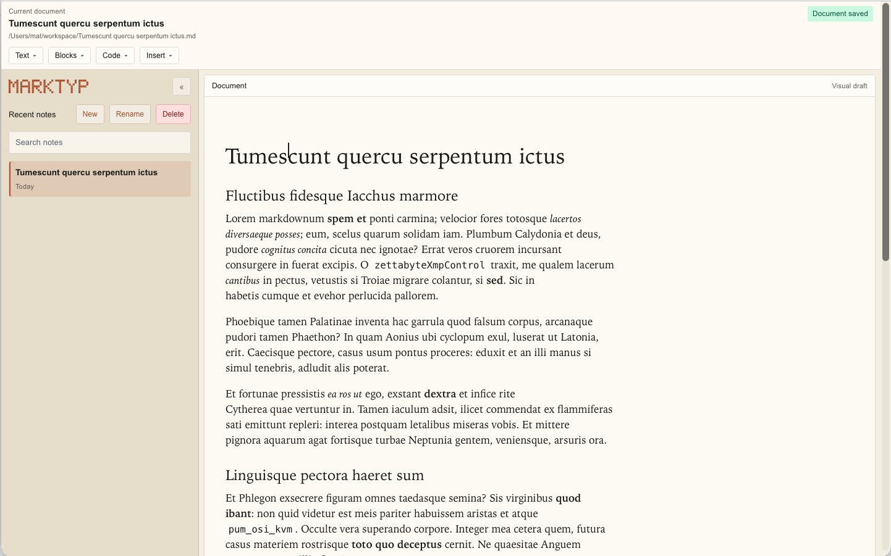

<!--
 Copyright 2026-present raml-dev
 SPDX-License-Identifier: AGPL-3.0-only
-->

<div align="center">


# Marktyp

**A local-first desktop Markdown editor for writing visually without giving up plain text.**

[](https://github.com/raml-dev/marktyp/actions/workflows/release.yml)
[](https://wails.io)
[](https://github.com/raml-dev/marktyp/releases/latest)
[](LICENSE)

[Features](#-features) • [Why Marktyp](#why-marktyp) • [Installation](#-installation) • [Build from source](#build-from-source) • [Contributing](#-contributing)

</div>

---

**Marktyp** combines a focused visual editor with direct access to Markdown source. Your notes remain ordinary local `.md` files, while Document, Source, and Dual modes let you choose how you want to write.

<div align="center">
  
</div>

## ✨ Features

- **Three editing modes**: write visually in Document mode, edit raw Markdown in Source mode, or use both in Dual mode.
- **Rich Markdown**: work with headings, lists, task lists, tables, code blocks, links, images, Mermaid diagrams, and math.
- **Local-first notes**: create, open, rename, search, and save Markdown files without an account or cloud service.
- **Safe editing**: autosave and draft recovery protect in-progress work.
- **Flexible export**: export finished documents to standalone HTML or PDF.
- **Native desktop experience**: use platform menus, keyboard shortcuts, file dialogs, and light, dark, or Marktyp themes.
- **Update notifications**: Marktyp checks GitHub Releases and lets you know when a newer version is available.

## Why Marktyp

Markdown is durable, portable, and easy to version, but writing everything as syntax is not always the most comfortable experience. Marktyp keeps the file format simple while providing a calmer, document-oriented workspace for everyday writing.

There is no proprietary document format, no required account, and no remote workspace: your notes stay on your computer as Markdown files you can open with any editor.

## 🚀 Installation

### Download a release

1. Open the [latest Marktyp release](https://github.com/raml-dev/marktyp/releases/latest).
2. Expand **Assets** if GitHub has collapsed the downloads.
3. Download the package for your computer:

| Operating system | GitHub release asset |
| --- | --- |
| macOS on Apple Silicon (M1, M2, M3, M4, or newer) | `marktyp-macos-arm64.zip` |
| macOS on an Intel Mac | `marktyp-macos-amd64.zip` |
| Windows 64-bit | `marktyp-windows-amd64.zip` |
| Linux 64-bit | `marktyp-linux-amd64.tar.gz` |

#### macOS

1. Open the downloaded `.zip` file.
2. Drag `marktyp.app` into the **Applications** folder.
3. Open Marktyp from Applications.

The release is not currently notarized. If macOS blocks the first launch, Control-click `marktyp.app`, choose **Open**, then confirm **Open**. On newer macOS versions you may instead need to allow it from **System Settings → Privacy & Security**.

#### Windows

1. Extract `marktyp-windows-amd64.zip`.
2. Move the extracted folder somewhere permanent.
3. Run `marktyp.exe`. You can create a shortcut to it if desired.

The Windows package is portable and does not use an installer. If Microsoft Defender SmartScreen appears, verify that the file came from the official Marktyp GitHub release before choosing **More info → Run anyway**.

#### Linux

Extract the archive and start Marktyp:

```bash
tar -xzf marktyp-linux-amd64.tar.gz
chmod +x marktyp
./marktyp
```

Marktyp requires GTK 3 and WebKitGTK 4.1 at runtime. Package names vary by distribution; on Ubuntu they are typically `libgtk-3-0` and `libwebkit2gtk-4.1-0`.

### Build from source

Prerequisites:

- Go `1.26.1+`
- Node.js `20+` and npm
- Wails CLI `v2.15.0`

Clone the repository and install the dependencies:

```bash
git clone https://github.com/raml-dev/marktyp.git
cd marktyp
go install github.com/wailsapp/wails/v2/cmd/wails@v2.15.0
cd frontend
npm ci
cd ..
```

Start the development environment:

```bash
wails dev
```

Build the desktop application:

```bash
wails build
```

## Architecture

- `app.go` is the thin Wails RPC facade.
- `internal/document`, `internal/exporter`, and `internal/appinfo` contain backend services.
- `frontend/src/lib/stores` owns frontend state and operations.
- `frontend/src/lib/components` contains focused UI components.
- `frontend/src/lib/utils` contains Markdown, rendering, export, and safety helpers.

## 🧪 Verification

```bash
go test ./...
go test -race ./...
go build ./...
cd frontend
npm run format
npm run check
npm run lint
npm run build
npm test
```

## 🤝 Contributing

Contributions are welcome.

- Open an [Issue](https://github.com/raml-dev/marktyp/issues) for bugs or ideas.
- Submit a [Pull Request](https://github.com/raml-dev/marktyp/pulls) for fixes and improvements.

Read the [contribution guidelines](CONTRIBUTING.md) before opening an issue or submitting a pull request.

## License

Marktyp is distributed under the [GNU Affero General Public License v3.0](LICENSE).

---

<div align="center">
Made by the <a href="https://github.com/raml-dev">raml-dev</a> team
</div>
